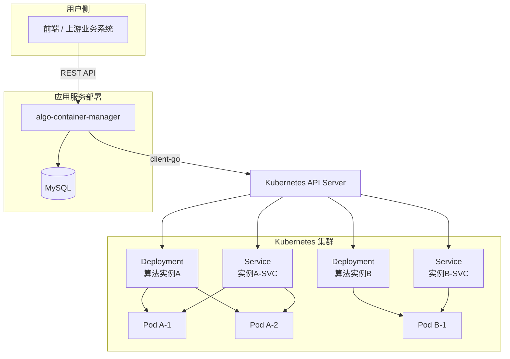
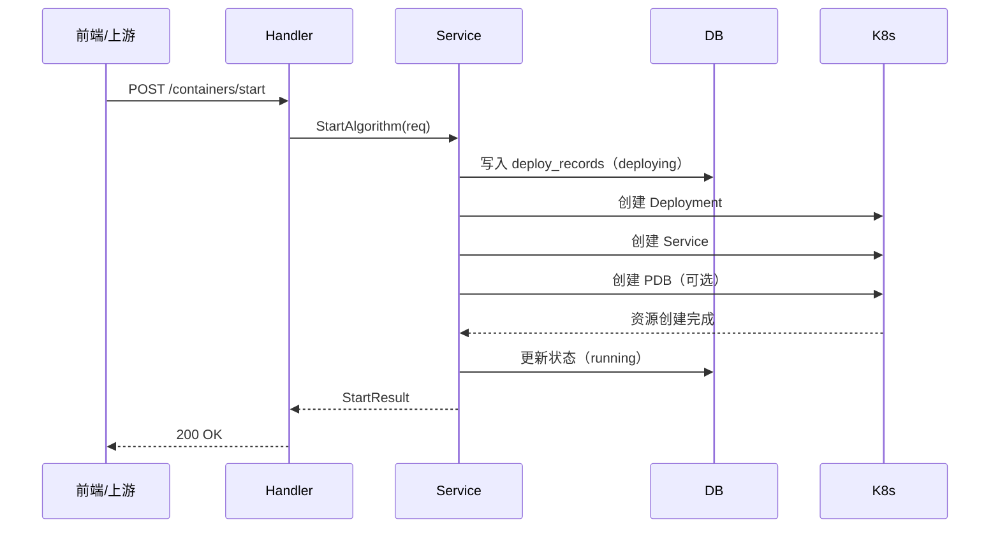

# GD-MVP项目开发文档

## 1. 项目概述

### 1.1 项目目标

GD-MVP 项目面向算法流标准化、算法选型与运行管理场景，目标是构建一套具备最小可用能力的算法管理与运行支撑系统。系统需要支持算法镜像的注册、算法容器的启动与运行状态管理，并为后续算法链路编排、资源调度和最优组合管理提供基础能力。

在当前 1.0 阶段，系统重点实现算法容器管理 Demo，通过接入 Kubernetes 集群，对“已注册算法镜像”进行运行时管理，完成容器启动、状态查询、扩缩容、重启、删除等核心能力验证。

### 1.2 Demo目标

构建一个基于Kubernetes的算法容器管理demo，实现对“已注册算法镜像”的运行时管理，支撑算法链路编排中的容器启动、状态监控、基础运维和服务接入展示。

### 1.3 当前能力范围

当前Demo覆盖以下功能：

| 功能         | 接口 / 机制                           | 预期结果                                          | 实际结果 |
| ------------ | ------------------------------------- | ------------------------------------------------- | -------- |
| 启动容器     | POST /api/v1/containers/start         | 创建 Deployment / Service / PDB，落库成功         | 成功     |
| 查询部署记录 | GET /api/v1/containers                | 返回 deploy_records                               | 成功     |
| 查询运行列表 | GET /api/v1/containers/runtime        | 返回 K8s 实例                                     | 成功     |
| 查询状态     | GET /api/v1/containers/:name/status   | 返回 replicas / readyReplicas / availableReplicas | 成功     |
| 扩缩容       | POST /api/v1/containers/:name/scale   | 副本数变化                                        | 成功     |
| 重启         | POST /api/v1/containers/:name/restart | Pod 重建                                          | 成功     |
| 删除         | DELETE /api/v1/containers/:name       | K8s 和 DB 同步删除                                | 成功     |
| 自动恢复     | LivenessProbe + RestartPolicy         | 容器异常后自动重启                                | 成功     |
| 就绪摘流     | ReadinessProbe                        | 未就绪 Pod 不接收流量                             | 成功     |
| 可用性保护   | Replicas + PDB                        | 维护/驱逐场景下保证最小可用副本                   | 成功     |

## 2.系统总体设计

## 2.1 系统目标

系统作为算法容器管理服务，位于上游业务系统与 Kubernetes 集群之间，承担如下职责：

- 接收上游算法启动与管理请求
- 编排 Deployment、Service、PDB 等 Kubernetes 资源创建流程
- 管理部署记录与状态流转
- 提供统一的查询与运维接口
- 将 Kubernetes 运行状态转换为平台可读的数据结构返回

## 2.2 系统架构说明

系统整体分为两部分：

1. **算法容器管理服务**
    - 负责请求接入、参数校验、业务编排、状态流转、Kubernetes 资源管理
2. **基础设施层**
    - 负责容器编排、实例运行、健康检查、部署记录存储

其中，算法容器管理服务通过 `client-go` 与 Kubernetes API Server 通信，实现 Deployment、Service 和 PodDisruptionBudget 等资源对象的创建与维护；同时通过 MySQL 持久化部署记录，形成系统的管理数据视图。




## 3. 模块设计

### 3.1 Kubernetes 客户端初始化模块

#### 3.1.1 模块功能

Deployment 管理模块用于在 Kubernetes 集群中创建和管理算法容器实例。系统根据用户请求动态生成 Deployment 资源，支持副本管理、资源限制、滚动更新、健康检查和基础自动恢复功能。

#### 3.1.2 接口定义

```go
func NewClientSet() (*kubernetes.Clientset, error)
```

##### 3.1.3 实现说明

模块通过读取本地 `kubeconfig` 文件获取 Kubernetes 集群连接信息，并生成客户端配置 `rest.Config`。随后调用 `kubernetes.NewForConfig()` 创建 `Clientset` 对象，用于访问 Kubernetes API Server。该模块是所有 Kubernetes 操作能力的入口，后续 Deployment 创建、Service 创建、扩缩容、删除等操作均基于该客户端执行。

### 3.2 Deployment 管理模块

#### 3.2.1 模块功能

Deployment管理模块用于在Kubernetes集群中创建和管理算法容器实例，系统根据用户请求动态生成Deployment资源，支持副本管理、资源限制、滚动更新及健康检查功能。

#### 3.2.2 接口定义

```go
func CreateDeployment(clientset *kubernetes.Clientset, req model.StartAlgorithmRequest) error
```

#### 3.2.3 输入参数

| 参数名    | 类型                                                   | 说明              |
| --------- | ------------------------------------------------------ | ----------------- |
| clientset | `*kubernetes.Clientset`                                | Kubernetes 客户端 |
| req       | `model.StartAlgorithmRequest`（详见 5.1 启动算法接口） | 算法启动请求      |

#### 3.2.4 实现说明

根据算法启动请求中的参数构建 Deployment 对象。系统首先读取算法名称、命名空间、镜像地址、副本数、端口、环境变量、CPU 和内存资源等信息，完成默认值处理和环境变量转换。随后组装 Deployment 的元数据、标签选择器、Pod 模板及容器配置，并设置资源请求与限制。

在容器健康管理方面，系统为容器配置了：

- **ReadinessProbe（就绪探针）**：用于判断容器是否可以接收流量。若探针未通过，则对应 Pod 不会加入 Service 后端。
- **LivenessProbe（存活探针）**：用于判断容器是否仍然健康存活。若探针持续失败，Kubernetes 将自动重启该容器。
- **RestartPolicyAlways**：当容器异常退出时，Pod 会自动重启。

因此，该模块不仅负责完成算法容器部署，还提供了基于 Kubernetes 原生机制的基础自动恢复能力。

### 3.3 Service 管理模块

#### 3.3.1 模块功能

Service 管理模块负责为算法容器暴露统一的访问入口，并与 Deployment 所创建的 Pod 建立稳定绑定关系。当某些 Pod 未通过就绪探针时，Service 会自动将其从可用后端中剔除，从而保证外部流量仅转发至健康实例。

#### 3.3.2 接口定义

```Go
func CreateService(clientset *kubernetes.Clientset, req model.StartAlgorithmRequest) error
```

#### 3.3.3 输入参数

| 参数名    | 类型                                                   | 说明              |
| --------- | ------------------------------------------------------ | ----------------- |
| clientset | `*kubernetes.Clientset`                                | Kubernetes 客户端 |
| req       | `model.StartAlgorithmRequest`（详见 5.1 启动算法接口） | 算法启动请求      |

#### 3.3.4 实现说明

该模块根据 `StartAlgorithmRequest` 中的算法名称、命名空间、服务端口及标签信息构建 Service 对象。Service 的选择器与 Deployment 中 Pod 模板的标签保持一致，从而将 Service 正确绑定到目标 Pod。创建完成后，系统可基于 Service 名称拼接访问地址，作为对外访问入口展示给调用方。

### 3.4 PodDisruptionBudget 管理模块

#### 3.4.1 模块功能

PodDisruptionBudget（PDB）管理模块用于在开启高可用场景下，约束 Pod 自愿中断行为，避免在节点升级、驱逐或维护过程中算法服务全部不可用。

#### 3.4.2 接口定义

```go
func CreatePDB(clientset *kubernetes.Clientset, req model.StartAlgorithmRequest) error
```

#### 3.4.3 实现说明

当请求中开启 `EnablePDB` 时，系统自动创建与目标 Deployment 匹配的 PodDisruptionBudget 资源，并基于 `MinAvailable` 配置最小可用副本数。

PDB 的作用主要体现在以下场景：

- 节点排空
- Pod 驱逐
- 集群升级
- 人工维护

通过约束最小可用副本数，系统可在多副本场景下保持算法服务的连续可用，提升整体稳定性。

### 3.5 容器启动编排模块

#### 3.5.1 模块功能

启动编排模块是系统核心业务模块，负责完成一次完整的算法容器启动流程，包括参数校验、部署记录写入、Kubernetes 资源创建和最终状态更新。

#### 3.5.2 接口定义

```go
func (s *ContainerService) StartAlgorithm(req model.StartAlgorithmRequest) (*model.StartResult, error)
```

#### 3.5.3 实现说明

系统接收到启动请求后，首先校验算法名称、镜像地址、端口等关键参数。随后生成 `deploymentName` 和 `serviceName`，并在数据库表 `deploy_records` 中插入一条状态为 `deploying` 的部署记录。之后依次调用 Kubernetes 资源管理模块创建：

- Deployment
- Service
- PodDisruptionBudget（可选）

Deployment 创建完成后，Kubernetes 会自动维持目标副本数，并结合健康检查与重启策略在容器异常时触发自动恢复。资源创建成功后，系统更新数据库中的部署状态为 `running`，并返回运行结果，包括 Deployment 名称、Service 名称及访问地址等信息。若任一环节失败，则更新状态并返回错误。

### 3.6 运行状态查询模块

#### 3.6.1 模块功能

运行状态查询模块用于从 Kubernetes 集群中查询算法容器实例的运行情况，并将 Deployment、Pod 的状态转换为平台统一的数据结构返回给调用方。

#### 3.6.2 接口定义

```go
func (s *ContainerService) ListRuntimeContainers(namespace string) ([]model.ContainerInstance, error)
func (s *ContainerService) GetContainerStatus(name, namespace string) (*model.ContainerInstance, error)
```

#### 3.6.3 实现说明

该模块基于 Kubernetes Client 查询指定命名空间下的 Deployment、Pod 和 Service 信息，并提取副本数、就绪副本数、可用副本数、镜像地址和访问入口等信息，封装为 `ContainerInstance` 返回。该模块主要服务于“运行视角”查询场景。

### 3.7 扩缩容模块

#### 3.7.1 模块功能

扩缩容模块用于动态修改指定 Deployment 的副本数，以满足算法服务在不同负载下的弹性伸缩需求。

#### 3.7.2 接口定义

```go
func (s *ContainerService) ScaleContainer(name string, replicas int32, namespace string) error
```

#### 3.7.3 实现说明

系统接收到扩缩容请求后，通过 Kubernetes Client 获取目标 Deployment，并更新其 `spec.replicas` 字段。Kubernetes 控制器会根据新的副本数自动完成 Pod 的扩容或缩容。该模块为后续自动扩缩容能力预留了基础接口。

### 3.8 重启模块

#### 3.8.1 模块功能

重启模块用于对指定算法容器实例执行重启操作，适用于容器异常恢复或配置刷新等场景。

#### 3.8.2 接口定义

```Go
func (s *ContainerService) RestartContainer(name, namespace string) error
```

#### 3.8.3 实现说明

系统通过更新 Deployment 的 Pod Template 注解或触发滚动更新机制，使 Kubernetes 重新创建对应 Pod，从而实现容器重启。该方式不直接删除 Deployment，而是通过 Kubernetes 原生控制逻辑完成安全重建。

### 3.9 删除模块

#### 3.9.1 模块功能

删除模块用于删除指定算法实例对应的 Kubernetes 资源，并同步清理数据库中的部署记录。

#### 3.9.2 接口定义

```Go
func (s *ContainerService) DeleteContainer(name, namespace string) error
```

#### 3.9.3 实现说明

系统根据容器实例名称删除对应的 Deployment 和 Service 资源，并同步删除或更新 `deploy_records` 中的记录。该模块确保“运行视角”和“管理视角”保持一致。

## 4. 数据结构设计

本章节描述系统核心数据结构，用于支撑算法注册、算法容器管理以及算法链路编排等功能模块的数据交互与存储。

### 4.1 AlgorithmMeta

`AlgorithmMeta` 用于描述算法的基础元数据信息，主要用于算法注册、算法查询以及算法管理等功能模块。该结构记录算法唯一标识、算法编码、算法类型以及运行环境等信息。主要用于平台侧算法管理，与算法容器部署配置解耦，用于描述算法本身的属性信息。

**AlgorithmMeta 结构定义**

| 字段名        | 类型   | 必填 | 说明                                                   |
| ------------- | ------ | ---- | ------------------------------------------------------ |
| algorithmId   | uint64 | √    | 算法唯一标识                                           |
| algorithmCode | string | √    | 算法编码，用于系统内部唯一识别算法                     |
| name          | string | √    | 算法名称                                               |
| algorithmType | string | ×    | 算法类型，如 detection / classification / segmentation |
| framework     | string | ×    | 算法框架，例如 PyTorch、TensorFlow                     |
| runtimeType   | string | ×    | 运行环境类型，例如 CPU、GPU                            |

`AlgorithmMeta` 为算法元数据的逻辑模型，用于描述算法注册、查询及容器部署所需的核心字段。其实现层可映射为后端实体对象，并与数据库表 `algorithm_meta` 对应。

### 4.2 StartAlgorithmRequest

| 字段名             | 类型              | 必填 | 说明                       |
| ------------------ | ----------------- | ---- | -------------------------- |
| algorithmVersionId | uint64            | √    | 算法版本 ID                |
| imageId            | uint64            | √    | 镜像 ID                    |
| name               | string            | √    | 算法名称                   |
| version            | string            | ×    | 算法版本                   |
| image              | string            | √    | 容器镜像地址               |
| namespace          | string            | ×    | Kubernetes 命名空间        |
| deploymentName     | string            | ×    | Deployment 名称            |
| serviceName        | string            | ×    | Service 名称               |
| port               | int32 / int       | √    | 容器服务端口               |
| replicas           | int32 / int       | ×    | Pod 副本数量               |
| env                | map[string]string | ×    | 容器环境变量               |
| cpu                | string            | ×    | CPU 资源限制               |
| memory             | string            | ×    | 内存资源限制               |
| readyPath          | string            | ×    | 就绪探针路径，如 `/ready`  |
| healthPath         | string            | ×    | 存活探针路径，如 `/health` |
| enablePDB          | bool              | ×    | 是否启用 PDB               |
| minAvailable       | int32             | ×    | PDB 最小可用副本数         |

该结构主要用于算法启动接口的请求参数，并作为 Kubernetes Deployment 创建时的配置来源。系统在接收到启动算法请求后，会根据该结构中的参数构建 Deployment 对象，并提交至 Kubernetes 集群进行容器部署。也直接决定容器运行时的资源配置、健康检查策略以及可用性保护策略。
其中：

- `readyPath` 用于配置 ReadinessProbe
- `healthPath` 用于配置 LivenessProbe
- `enablePDB` 和 `minAvailable` 用于配置 PodDisruptionBudget

### 4.3 ContainerInstance

`ContainerInstance` 用于描述算法容器在 Kubernetes 集群中的运行实例信息，主要用于展示算法运行状态以及容器副本情况。

**ContainerInstance 结构定义**

| 字段              | 类型   | 说明               |
| ----------------- | ------ | ------------------ |
| name              | string | 算法实例名称       |
| namespace         | string | Kubernetes命名空间 |
| deployment        | string | Deployment名称     |
| service           | string | Service名称        |
| status            | string | 当前运行状态       |
| image             | string | 容器镜像           |
| replicas          | int    | 期望副本数         |
| readyReplicas     | int    | 已就绪副本数       |
| availableReplicas | int    | 可用副本数         |
| accessEndpoint    | string | 容器服务访问地址   |

该结构主要用于算法容器管理模块查询算法实例状态时返回的数据结构。当用户调用查询算法实例接口时，系统从 Kubernetes 集群中获取 Deployment 与 Pod 的运行状态，并将其转换为 `ContainerInstance` 对象返回给调用方。

------

| 功能         | 接口                           | 预期结果                          | 实际结果 |
| ------------ | ------------------------------ | --------------------------------- | -------- |
| 启动容器     | POST /containers/start         | 创建 Deployment/Service，落库成功 | 成功     |
| 查询部署记录 | GET /containers                | 返回 deploy_records               | 成功     |
| 查询运行列表 | GET /containers/runtime        | 返回 K8s 实例                     | 成功     |
| 查询状态     | GET /containers/:name/status   | 返回 replicas/readyReplicas       | 成功     |
| 扩缩容       | POST /containers/:name/scale   | 副本数变化                        | 成功     |
| 重启         | POST /containers/:name/restart | Pod 重建                          | 成功     |
| 删除         | DELETE /containers/:name       | K8s 和 DB 同步删除                | 成功     |

# 

API调用时序图



### 数据库设计

#### 表名：`deploy_records`

| 字段名               | 类型         | 必填 | 说明           |
| -------------------- | ------------ | ---- | -------------- |
| id                   | bigint       | ✅    | 主键ID         |
| uuid                 | varchar(36)  | ✅    | 全局唯一标识   |
| algorithm_version_id | bigint       | ✅    | 算法版本ID     |
| image_id             | bigint       | ✅    | 镜像ID         |
| namespace            | varchar(64)  | ❌    | K8s命名空间    |
| k8s_deployment_name  | varchar(128) | ✅    | Deployment名称 |
| k8s_service_name     | varchar(128) | ✅    | Service名称    |
| deploy_status        | varchar(16)  | ✅    | 部署状态       |
| access_endpoint      | varchar(255) | ❌    | 访问地址       |
| deployed_at          | datetime     | ✅    | 部署时间       |
| updated_at           | datetime     | ✅    | 更新时间       |

## 5. API设计

### 5.1 启动算法容器

### 请求参数

| 字段               | 必填 | 类型   | 说明           |
| ------------------ | ---- | ------ | -------------- |
| algorithmVersionId | √    | uint64 | 算法版本 ID    |
| imageId            | √    | uint64 | 镜像 ID        |
| name               | √    | string | 算法名称       |
| version            | ×    | string | 算法版本       |
| image              | √    | string | 镜像地址       |
| namespace          | ×    | string | 默认 default   |
| port               | √    | int    | 服务端口       |
| replicas           | ×    | int    | 默认 1         |
| env                | ×    | object | 环境变量       |
| cpu                | ×    | string | CPU 限制       |
| memory             | ×    | string | 内存限制       |
| readyPath          | ×    | string | 就绪探针路径   |
| healthPath         | ×    | string | 存活探针路径   |
| enablePDB          | ×    | bool   | 是否启用 PDB   |
| minAvailable       | ×    | int    | 最小可用副本数 |

### 请求示例

```
{
  "algorithmVersionId": 1,
  "imageId": 1,
  "name": "algo-health-demo",
  "version": "v1",
  "image": "yuananananan/health-demo:latest",
  "namespace": "default",
  "port": 8080,
  "replicas": 2,
  "env": {
    "APP_ENV": "dev"
  },
  "cpu": "500m",
  "memory": "512Mi",
  "readyPath": "/ready",
  "healthPath": "/health",
  "enablePDB": true,
  "minAvailable": 1
}
```

